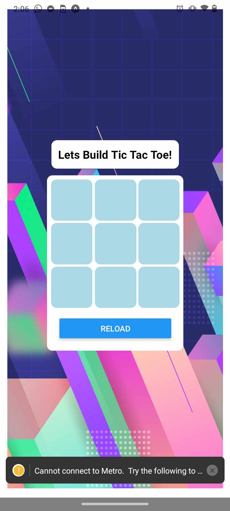

### Rebuild of my Tic-Tac-Toe app in React Native

I tried to retro my react app into react-native to deploy on android. However I hit many hurdles due to inexperience.

This project is to run through the process of building TicTacToe but using react-native designs from the ground up.

Starting with rendering the background and implamenting simple button functionality. I will work and add to the app as I work out each part.

Requirements:

- Expo
- Expo Go
- react-native
- VSCODE
- Caffine

## EXPO Go app running

This application is now fully functional using EXPO Go.

To deploy ensure you have Expo on your machine.
Steps:

- Clone this Repo
- 'npm install' for dependancies
- 'npx expo' to start Expo application server
- Use the QR code in the EXPO Go application to connect to this application
- Play tic-tac-toe with a friend

